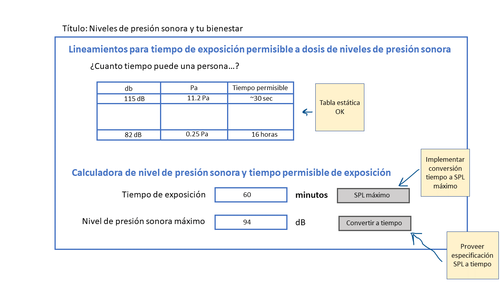
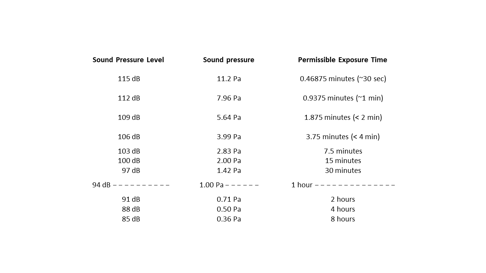

# INSTITUTO TECNOLÓGICO Y DE ESTUDIOS SUPERIORES DE MONTERREY - CAMPUS ESTADO DE MÉXICO
## TC2005B: CONSTRUCCIÓN DE SOFTWARE Y TOMA DE DECISIONES
## MÓDULO 3: DESARROLLO TECNOLÓGICO Y DESARROLLO WEB
## PRIMERA EVALUACIÓN PARCIAL
## PROF. MARCIANO ALBERTO MORENO DÍAZ COVARRUBIAS

## Requisitos
* Computadora personal con conectividad a Internet.
* Cuenta de GitHub dada de alta en el classroom de GitHub for Education del grupo.
* Enlace de la asignación en el classroom de GitHub for Education correspondiente al examen.
* Ambiente de desarrollo para aplicación web implementada con TypeScript

## Procedimiento
* Revisa con detenimiento las indicaciones provistas en este documento.
* Lleva a cabo las actividades solicitadas.
* Verifica que el código implementado cumpla con los requerimientos.
    * Asegúrate que los archivos estén guardados.
    * Por cada actividad completada del examen, registra los cambios de los archivos en el sistema de control de versiones local (commit) y publícalos al respositorio remoto (push).
* Verifica que el documento de requerimiento de especificación esté guardado y registrado en el sistema de control de versiones.
* Toma nota del número de commity correspondiente a tu última publicación del examen, así como el URL del repositorio. Registra esta información en Canvas.

## Duración del examen
100 minutos

# Inicio de examen
"Apegándome al Código de Ética de los Estudiantes del Tecnológico de Monterrey, me comprometo a que mi actuación en este examen esté regida por la honestidad académica".

## Contexto
La empresa Percussion Wellness, Inc. tiene como objeto social promover el bienestar por medio de las percusiones en todos los sectores de la población en el mundo. De acuerdo con información publicada en la disertación doctoral “An Analysis of the Sound-Level Exposures of Drum and Bugle Corps Members During a Full-Day Rehearsal” realizada por Douglas L. Presley en la Facultad de Estudios de Posgrado de la Universidad de Carolina del Norte en Greensboro, los intérpretes de tarola reciben promedio de dosis de 8188.17% y un rango de 4135.57 basado en un periodo de 12 horas.

Percussion Wellness, Inc. está buscando implementar un recurso para generar consciencia del tiempo permisible máximo que una persona puede exponerse a determinados niveles de presión sonora. Los estudios de mercado realizados por Percussion Wellness, Inc. identifican una gran área de oportunidad ya que los recursos existentes de generación de conciencia están implementados con tecnologías obsoletas, usabilidad limitada y en algunos casos funcionalidad incompleta.

## Requerimiento de implementación
Percussion Wellness, Inc. te ha contratado para implementar una página Web que proveerá información general de los niveles de presión sonora, lo tiempos permisibles de exposición, así como una calculadora interactiva que mostrará el tiempo máximo permisible de exposición a un nivel de presión sonora provisto por el usuario

La siguiente imagen muestra un bosquejo de la página esperada

### Título
Título de la página: Niveles de presión sonora y tu bienestar

### Encabezado 1

Encabezado 1: Lineamientos para tiempo de exposición permisible a dosis de niveles de presión sonora

### Párrafo

Párrafo: ¿Cuánto tiempo puede una persona exponerse a cierto nivel de sonido sin que le ocurra una lesión o impedimento en su escucha?

### Tabla

Tabla de exposición a niveles de presión sonora

Tres columnas

Encabezado columna 1: Nivel de presión sonora (db)

Encabezado columna 2: Nivel de presión (Pa)

Encabezado columna 3: Tiempo permisible de exposición

12 renglones con la información correspondiente a los niveles de exposición de acuerdo con la siguiente especificación

El tiempo permisible de exposición para 82 dB es de 16 horas. Por cada 3 dB adicionales el tiempo de exposición se reduce a la mitad.

Nivel mínimo de exposición de la tabla: 82 dB

Niveles intermedios de exposición de la tabla: Incrementos de 3 dB: 85 dB, 88 dB y así sucesivamente hasta 115 dB

Nivel máximo de exposición de la tabla: 115 dB

Ordenamiento de la tabla: Descendiente, de 115 dB a 82 dB

Requerimiento no funcional: No se requiere de automatización para generar la tabla, puede ser estática en HTML

### Encabezado 2

Encabezado 2: Calculadora de nivel de presión sonora y tiempo permisible de exposición

### Calculadora de nivel de presión sonora

Etiqueta 1: Tiempo de exposición

Caja de texto 1: 

Propósito: Captura del tiempo de exposición en minutos

Información a capturar en la caja de texto 1: Valor entero en el rango de 480 a 0.5 minutuos

Botón 1:

Texto del botón 1: Convertir a SPL máximo

Comportamiento del botón 1: Convertir la cantidad de minutos registrada por el usuario en la caja de texto al tiempo máximo de exposición de acuerdo con la tabla de conversión de SPL a tiempo y la información provista en esta especificación.

Por ejemplo, si el usuario ingresa 60 minutos en tiempo de ejecución, el sistema debe presentar 94 dB en la caja de texto número 2.

## Requerimientos técnicos para la implementación

De conformidad con los estándares arquitectónicos de Percussion Wellness, Inc. se solicita que la implementación cumpla con los siguientes requerimientos técnicos:
* Lenguaje de programación: TypeScript
* Tecnología de empaquetado: webpack
* Archivos separados para:
    * HTML
    * TypeScript
    * Hojas de estilo
        * El texto de los encabezados debe ser de color azul. La asignación de estilos debe efectuarse de forma dinámica en el procesador de TypeScript.

### Entregables requeridos:
* Archivo .gitignore en el cual deben ignorarse las carpetas node_modules y dist
* Archivo de HTML con los elementos requeridos para el contenido.
* Archivo de TypeScript para la producción del contenido dinámico de la página.
* Archivo de TypeScript con la implementación de la función de conversión a tiempo de exposición.
* Archivos de configuración de la solución (TypeScript, webpack, entre otros de haber).

## Requerimiento de especificación
Como parte del plan de mejoras a esta página se está considerando implementar otra sección con un convertidor de nivel de presión sonora máximo a tiempo con los siguientes requerimientos, los cuales no deben ser implementados en este momento.

### Conversión de tiempo permisible a nivel de exposición
Etiqueta 2: Nivel de presión sonora máximo

Caja de texto 2:

Propósito: Capturar el nivel de presión sonora (SPL) máximo al que un usuario se puede enfrentar sin daño auditivo.

Información a capturar en la caja de texto 2: Cantidad de SPLs de exposición, valor entero.

Botón 2:

Texto del botón 2: Convertir a tiempo máxiom de exposición

Comportamiento del botón 2: Convertir el nivel de presión sonora al tiempo máximo de exposición de acuerdo con la información provista en la tabla de esta especificación.

Se te solicita proveer un diseño y especificación funcional para este requerimiento indicando las consideraciones relevantes en cuanto usabilidad tomando en cuenta que el tiempo permisible de exposición varía desde horas hasta segundos.

### Entregables requeridos
* Documento en formato markdown con la respuesta al requerimiento de especificación.
